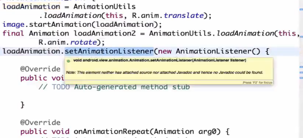

# 变换动画（Tween）

## 1、分类

## 2、基本使用

### 2.1 共同属性

### 2.2 实现方式

1）

2）

### 2.3 具体介绍

#### 2.3.1 AlphaAnimation

#### 2.3.2 ScaleAnimation

#### 2.3.3 TranslateAnimation

#### 2.3.4 RotateAnimation 

## 3、组合使用

### 3.1 续播

#### 3.1.1 方式一

#### 3.1.2方式二

\#\#

